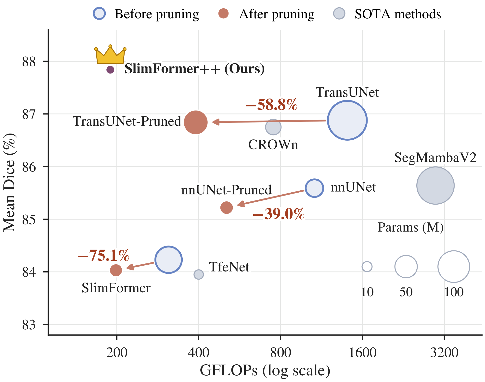
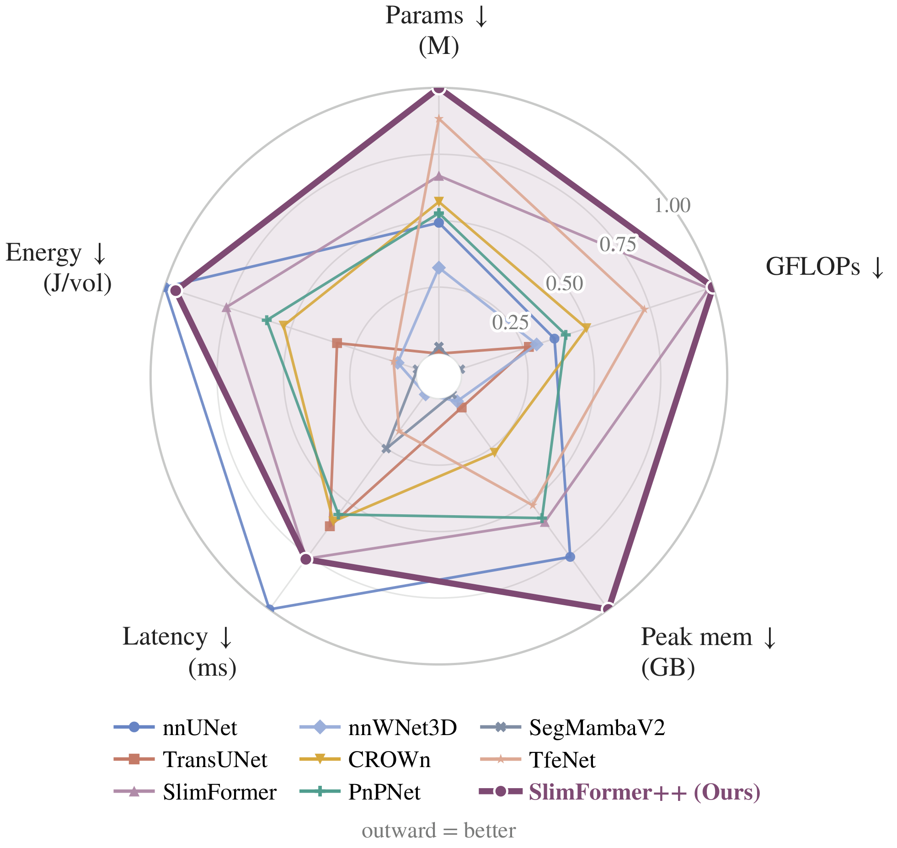

# SlimFormer++

SlimFormer++ is a 3D medical image segmentation network for nnU-Net v2.
The model and trainer are in [one file](nnUNetTrainer_SlimFormerPlusPlus.py).

## Performance and efficiency

<p align="center">
  
  
</p>

Left: segmentation performance versus computational cost. Right: normalized
comparison of model size, memory use and runtime.

## Installation

Python 3.12. Install PyTorch and torchvision together first, from the `cu*`
index that matches your CUDA driver ([versions](https://pytorch.org/get-started/previous-versions/)).
If torchvision is missing, pip pulls the latest one and replaces your PyTorch.

```bash
python -m pip install torch==2.6.0 torchvision==0.21.0 --index-url https://download.pytorch.org/whl/cu126
python -m pip install setuptools wheel packaging ninja
python -m pip install --no-build-isolation -r requirements.txt
python -m pip check
python install.py
python smoke_test.py --cuda
```

`mamba-ssm` and `causal-conv1d` are installed from their release tags. Prebuilt
wheels exist only for x86_64 with PyTorch 2.0–2.4; elsewhere they are compiled
from source, which needs `nvcc` matching PyTorch's CUDA version and can take
tens of minutes. Set `MAX_JOBS=4` if memory is limited.

If nnUNetv2 is already installed, use `requirements-model.txt` instead of
`requirements.txt`. `install.py` copies the trainer into the active nnU-Net
installation. Tested with Python 3.12.3, PyTorch 2.6.0 (CUDA 12.6),
torchvision 0.21.0 and nnUNetv2 2.6.2 on Linux aarch64 (NVIDIA GH200).

## Data and pretrained checkpoints

| Dataset | Input | Best checkpoint |
| --- | --- | --- |
| ACDC (`Dataset003_ACDC`) | MRI | [Download](https://github.com/WHHHHHY822/SlimFormerPlusPlus/releases/tag/acdc-best-v1) |
| AbdomenCT-1K (`Dataset002_AbdomenCT1K`) | CT | [Download](https://github.com/WHHHHHY822/SlimFormerPlusPlus/releases/tag/abdomenct1k-best-v1) |
| AMOS2022 (`Dataset004_AMOS`) | CT only | [Download](https://github.com/WHHHHHY822/SlimFormerPlusPlus/releases/tag/amos2022-ct-best-v1) |

Datasets: [ACDC](https://www.creatis.insa-lyon.fr/Challenge/acdc/databases.html),
[AbdomenCT-1K](https://github.com/JunMa11/AbdomenCT-1K) and
[AMOS2022](https://zenodo.org/records/7262581). See
[docs/DATASETS.md](docs/DATASETS.md) for how to arrange the images.

`predict.sh` downloads a checkpoint, checks its SHA256 and runs
`nnUNetv2_predict`:

```bash
export nnUNet_results="/path/to/nnUNet_results"
bash predict.sh amos-ct /path/to/imagesTs /path/to/predictions
# Replace amos-ct with acdc or abdomenct1k for the other checkpoints.
```

Input files need nnU-Net names (for example `case_0000.nii.gz`). More details
are in [docs/INFERENCE.md](docs/INFERENCE.md).

## Train on your data

Replace `2` with your dataset ID:

```bash
export nnUNet_raw="/path/to/nnUNet_raw"
export nnUNet_preprocessed="/path/to/nnUNet_preprocessed"
export nnUNet_results="/path/to/nnUNet_results"
export nnUNet_compile=false
nnUNetv2_plan_and_preprocess -d 2 --verify_dataset_integrity
nnUNetv2_train 2 3d_fullres 0 -tr nnUNetTrainer_SlimFormerPlusPlus
```

## Attention variant

[`nnUNetTrainer_SlimFormerPlusPlus_Attention`](nnUNetTrainer_SlimFormerPlusPlus_Attention.py)
uses window self-attention (3 heads, 8×8×8 windows) instead of the selective
mixer in encoder 1. Everything else is the same. It does not need `mamba-ssm`,
`causal-conv1d` or `transformers`. There are no pretrained checkpoints for it.

```bash
python -m pip install torch==2.6.0 torchvision==0.21.0 --index-url https://download.pytorch.org/whl/cu126
python -m pip install -r requirements-attention.txt
python -m pip check
python install.py --attention
python smoke_test.py --attention --cuda
```

To train it, use `-tr nnUNetTrainer_SlimFormerPlusPlus_Attention`.

## License

Noncommercial research use only. See [LICENSE](LICENSE), [NOTICE.md](NOTICE.md)
and [docs/VALIDATION.md](docs/VALIDATION.md).
